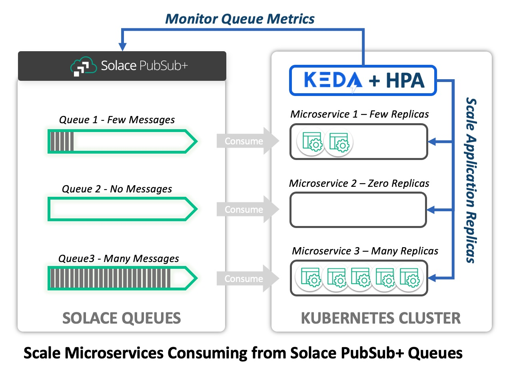

# partitioned-queue-demo
Code to demonstrate scalability using KEDA and Solace partitioned queues

# Key Concepts: How KEDA Works
**KEDA = Kubernetes Event-Driven Autoscaler**

KEDA is a Kubernetes operator that can be used to monitor external metrics and scale applications by creating and destroying pods based on the current value of those metrics. For Solace PubSub+, KEDA can monitor metrics of a queue and then apply scaling decisions based upon the current values. The diagram below depicts KEDA monitoring a Solace PubSub+ broker for the current queue depth (undelivered message count). Based upon the current backlog, KEDA scales a consumer deployment.



Scaling itself is actually done by the Kubernetes Horizontal Pod Autoscaler (HPA). KEDA provides a mechanism whereby resource specific metrics can be utilized for scaling decisions instead of the inherent CPU and Memory utilization that is available to HPA by default.

> **Note:** There should never by an HPA scaler defined for a deployment if using KEDA. KEDA configures HPA to use the identified metrics. Using both mechanisms concurrently will produce unpredictable results.

## Metrics and Scalers
KEDA provides the ability to monitor metrics from external systems and make run-time scaling decisions based upon those metrics. The ability to monitor specific kinds of resources (Solace PubSub+, Rabbit MQ, Amazon SQS, etc.) is provided by KEDA **scalers** contributed by the open-source community. [KEDA Scalers](https://keda.sh/docs/2.10/scalers/) Whatever metrics are sensible for a particular scaler can be defined by the community, as well as the mechanism for identifying the endpoint and providing the necessary credentials.

HPA scales Kubernetes workloads according to the following computation:
> desiredReplicas = ceil[currentReplicas * ( currentMetricValue / desiredMetricValue )]

Where `currentMetricValue` is the average value observerd across all instances. As the `currentMetricValue` fluctuates, HPA computes the number of desiredReplicas and scales the deployment accordingly.

### Solace Scaler
[Solace PubSub+ Event Broker](https://keda.sh/docs/2.10/scalers/solace-pub-sub/)

The Solace scaler defines the interface between KEDA and PubSub+ brokers. The interface connects to the SEMPv2 API and polls for metrics of a desired queue. 

**The queue metrics available for scaling are:**
- messageCountTarget - scale based on the number of underlivered messages in the queue. `collections.msgs.count`
- messageReceiveRateTarget - scale based on the one minute average rate of message delivery to the queue: `data.averageRxMsgRate`
- messageSpoolUsageTarget - scale based on the spool utilization attributed to the queue: `data.msgSpoolUsage`

> &#128161; **Target** metric is the desired average value to maintain for each replica/pod.

> &#128161; Multiple metric values can be specified for a particular deployment scaler. At each observation, the metric that computes the highest number of desired pods "wins"

> &#128161; `messageCountTarget` provides good reactivity to increasing workload. &#128293; By itself, this metric can introduce ***flapping***: the continuous creation and destruction of replicas, which can cause inconsistent performance. Achieving a steady state of consumers under continuous load is difficult to achieve using this metric alone.

> &#128161; `messageReceiveRateTarget` - useful to achieve good application performance based on the rate of ingress. Using this metric is advised to minimize **flapping** and to maintain performant applications. &#128293; By itself, this metric will not help scale up an application based on backlog. If ingress is very low, but a large backlog exists, the application will not scale up using this metric by itself.

> &#128161;&#128161; **Important** For best results, both `messageCountTarget` and `messageReceiveRateTarget` should be specified to configure a Solace Scaler.

# Components

**Core Component List**
- **Java Jar File** - Code for Solace Publisher and Consumer
- **Consumer Application Image** - Defined in Docker Image; Used for both the consumer and publisher apps
- **Consumer Application Deployment** - Defined in Kubernetes from  `solace-consumer.yaml`
- **Publisher Helper Pod** - A pod configured to publish messages in the K8s cluster; utilized interactively
- **KEDA** - Kubernetes Event Driven Autoscaler, A Kubernetes Operator and Metrics Server deployed to the Kubernetes cluster and configured to scale applications
- **KEDA Scaled Object** - Defines the scaled application and connection to Solace PS+ Broker and queue

## Jar File
Jar file with dependencies can be called with different class paths.

**Publisher App**
- Uses Java API (referencing JCSMP opaquely)
- Configure using ```crd/publisher-secret.yaml```
- Class: SolacePublisher
- Class: SolacePublisherBlocking

**Consumer App**
- Called in Deployment container
- Uses JCSMP API directly
- Configure using ```crd/consumer-secret.yaml```
- SolaceConsumer (Default) - Creates queue flow receiver flow and calls start() method; read in event handler

### Build Jar File
```bash
mvn clean package
```

## Application Image

After building the jar, create the application image using the docker file in the project root:
```bash
docker build -t solace-consumer:latest --file Dockerfile .
```

The resulting image will be tagged as `solace-consumer:latest`, though it is used in the consumer deployment and as a helper app to publish messages. You will need to load the image to your Kubernetes cluster before creating the applications.

## Install KEDA to Kubernetes Cluster
> **Note:** If you have KEDA installed but, but is earlier than v2.11, then it will have to be re-installed.
> **Note:** If you are installing before KEDA v2.11 is GA, you will have to install using over-rides to retrieve updated versions of the KEDA images.

```bash
helm repo add kedacore https://kedacore.github.io/charts

helm repo update

kubectl create namespace keda

helm install keda kedacore/keda --namespace keda
```

### Install Command Prior to KEDA v2.11 GA
```bash
helm install keda kedacore/keda --namespace keda \
--set image.keda.repository=ghcr.io/dennis-brinley/mykeda/keda \
--set image.keda.tag=main \
--set image.metricsApiServer.repository=ghcr.io/dennis-brinley/mykeda/keda-metrics-apiserver \
--set image.metricsApiServer.tag=main \
--set image.webhooks.repository=ghcr.io/dennis-brinley/mykeda/keda-admission-webhooks \
--set image.webhooks.tag=main
```

# Kubernetes CRDs

## Configure Components
It is best to make a copy of the crd/ folder in the project to someplace outside of the project. These files will contain configuration data including passwords and should never be committed back to the project.

### General Components
The following files should be configured for use in your environment with your PS+ service:
|File Name|Purpose|Configure|
|---------------------------------------|---|---|
|consumer-secret.yaml|Secrets and general configuration for the consumer application<br>Modify with your PS+ service details and<br>msg rate of consumption|
|solace-consumer.yaml|K8s deployment for the consumer application|**No Changes**|
|publisher-secret.yaml|Secrets and general configuration for the publisher application|Modify with your PS+ details and publisher rate<br>and partitioned key settings|
|publisher-helper.yaml|Helper pod definition; connect interactively to publish messages<br>at varying rates|**No Changes**|
|secret-auth.yaml|Secret for Login credentials and KEDA TriggerAuthentication|Modify the secret with your SEMP login credentials|

### KEDA Scalers
The following are KEDA Scaler definitions for use with PubSub+. You will need to configure SEMP endpoint details including Message VPN and queue. These scalers define settings to determine behavior of the applications. The same scaler name is used in all three CRD definitions.
|Scaler File Name|Purpose|Details|
|---|---|---|
|pq-scaler.yaml|Positive case<br>shows reactive scaling and steady-state under load|Scales applications from 1-12 replicas.<br>Uses `messageCountTarget=50` and `messageReceiveRateTarget=10`|
|pq-scaler-count-only.yaml|Show Flapping under steady load.<br>Illustrates why received message rate is important|Scales application from 1-12 replicas. Uses `messageCountTarget=50` **ONLY**.<br>Using this scaler instance will likely result in replica flapping under constant load. (negative result)|
|pq-scaler-two.yaml|Showcase multiple consumers per replica|Scales application from 1-6 instances. Uses `messageCountTarget=100` and `messageReceiveRateTarget=20`.<br>Intended for use with 2 consumers per replica.<br>**Important:** Use with `solace-consumer-two.yaml` deployment, which has 2 containers per replica.|

## Deploy Components
After updating configuration as specified above, deploy to Kubernetes and observe results using PS+ dashboard:

### 1. Observe scalability and steady-state under load

- Apply secrets
    ```bash
    kubectl apply -f crd/publisher-secret.yaml

    kubectl apply -f crd/consumer-secret.yaml

    kubectl apply -f crd/secret-auth.yaml
    ```
- Create Consumer
    ```bash
    kubectl apply -f crd/solace-consumer.yaml
    ```
- Create Publisher
    ```bash
    kubectl apply -f crd/publisher-helper.yaml
    ```
- Publish Messages
    ```bash
    kubectl exec -it publisher-helper -- /bin/bash

    ## should be logged into the pod
    ## publish at a rate of 35 msg/second (configurable)
    java -cp partitioned-queue-demo-0.1.0.jar com.solace.demo.SolacePublisher 35 
    ```
- Create the scaler
    ```bash
    kubectl apply -f crd/pq-scaler.yaml
    ```
- Observe the application scale up to consume the backlog, then reduce to a number of replicas necessary for steady consumption.

### Solace Consumer

Create the solace consumer deployment using ```crd/solace-consumer.yaml```. This will create a simple deployment, initially with 1 pod. The image must be visible to the Kubernetes cluster.

### Build the solace consumer image

Use the supplied docker file in project root. If using **minikube**, first set up the minikube environment so that the created image is available to the kubernetes instance:

```bash
eval $(minikube -p minikube docker-env)
```

Then build the consumer on the command line:
```
docker build -t solace-consumer:latest --file Dockerfile .
```

> &#128161; **Note:** The KEDA ScaledObject and TriggerAuthentication CRD definitions must be created in the same Kubernetes namespace as the scaled deployment.

## Burn it down

```bash
kubectl delete -f crd/pq-scaler.yaml

kubectl delete -f crd/solace-consumer.yaml

kubectl delete -f crd/publisher-helper.yaml

kubectl delete -f crd/publisher-secret.yaml

kubectl delete -f crd/consumer-secret.yaml

kubectl delete -f crd/secret-auth.yaml

## If you're so included:
helm uninstall -n keda keda
```
